# 🎮 Guess Duel

> A Flutter-based number guessing game where players can challenge themselves offline or compete against others in real-time multiplayer matches.

**Guess Duel** combines logic, strategy, and competition in a modern interactive experience.

The app supports **online multiplayer, offline solo challenges, authentication, game history, player statistics, local data persistence, animations, and real-time game synchronization.**

---

## 📱 Screenshots

### 🚀 App Overview

<p align="center">
  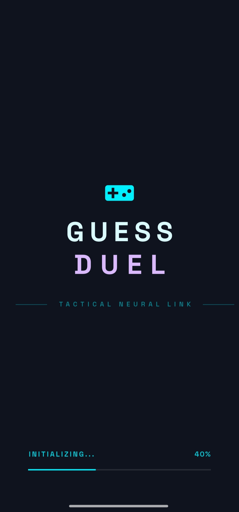
  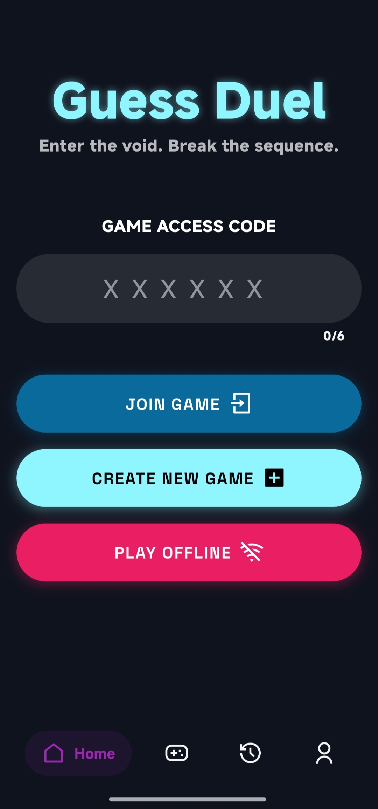
  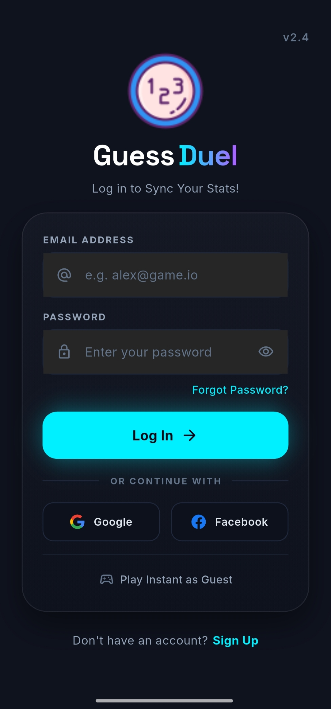
</p>

---

### 🌐 Online Multiplayer

Create or join a room and compete against another player in real time.

<p align="center">
  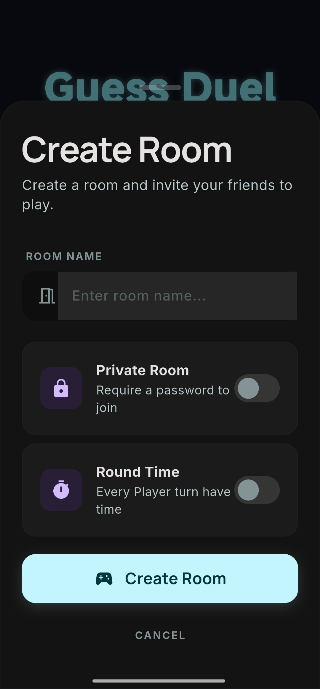
  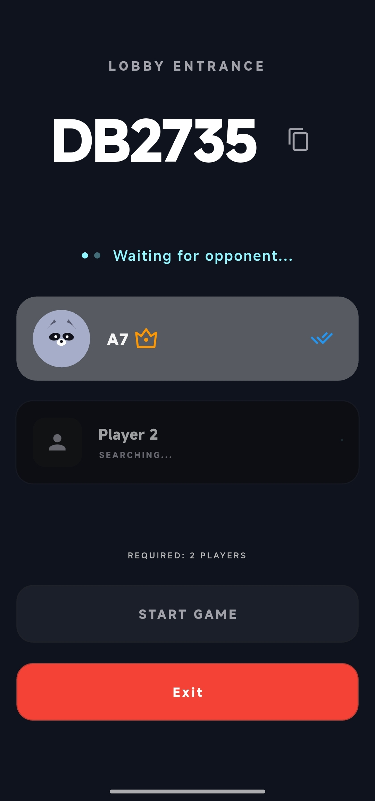
  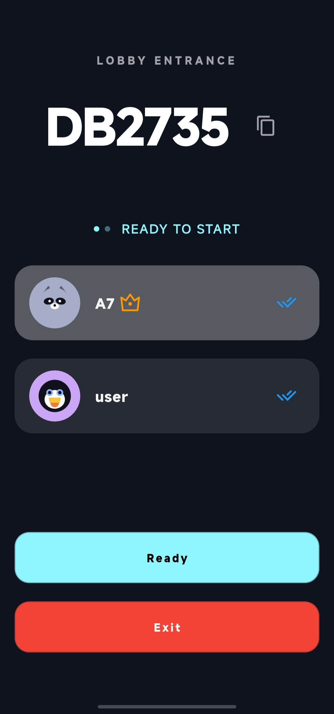
</p>

---

### 🎯 Gameplay

<p align="center">
  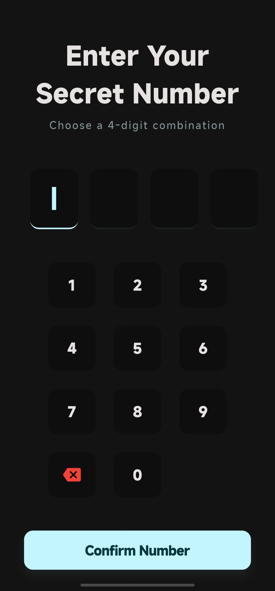
  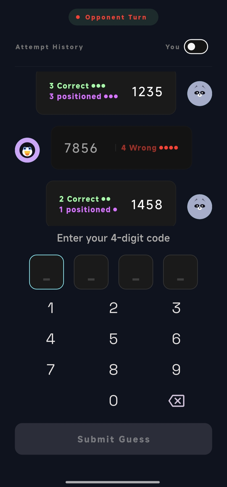
  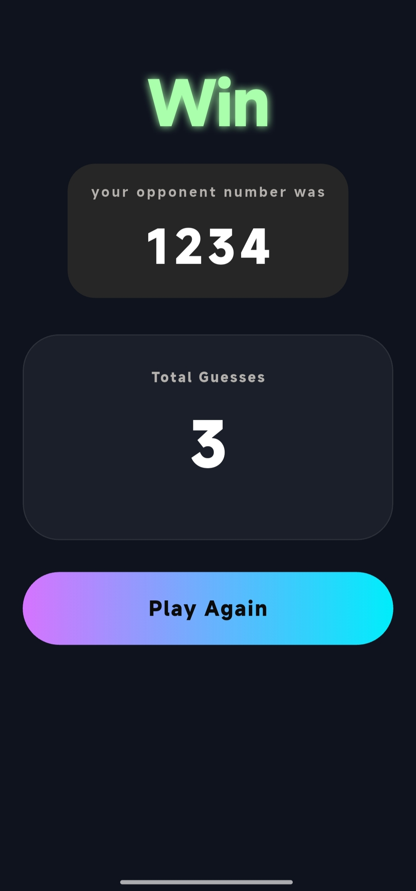
  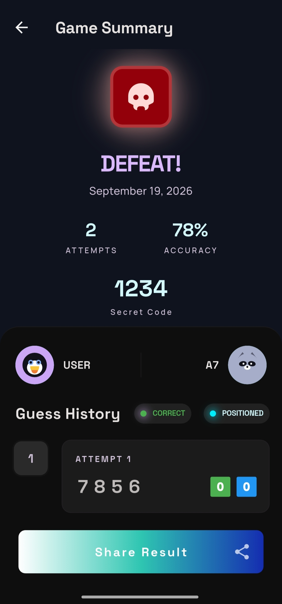
</p>

---

### 📴 Solo Challenge

Play a solo challenge without requiring an online multiplayer match.

<p align="center">
  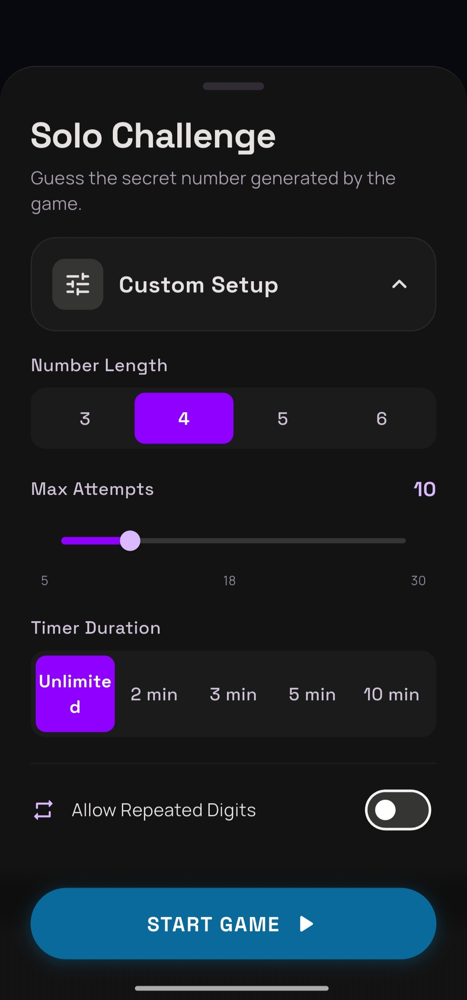
  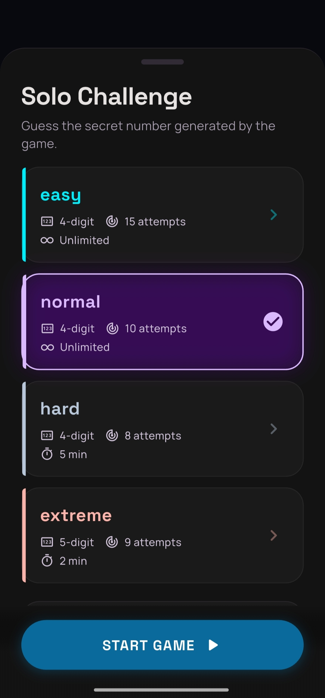
  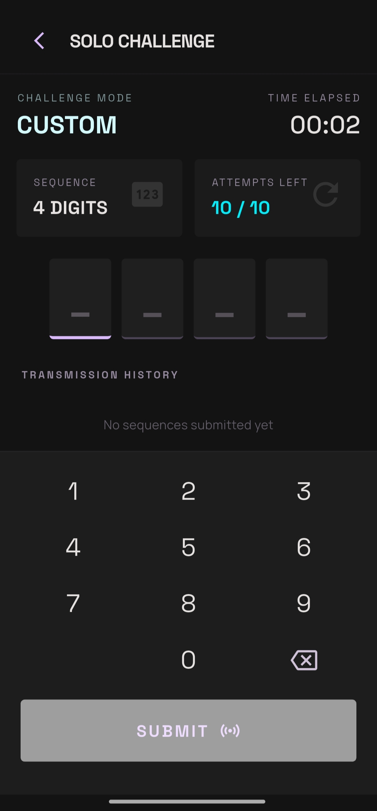
</p>

---

### 📊 Profile & History

Track your games, results, and player statistics.

<p align="center">
  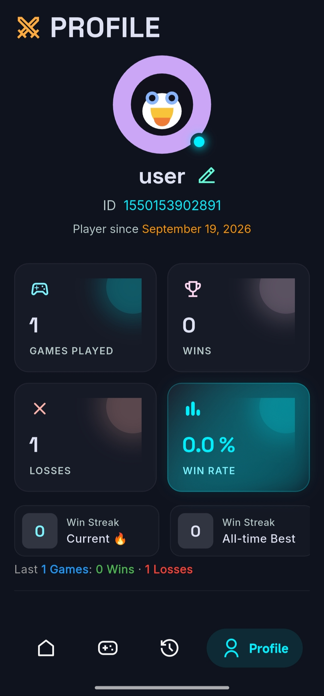
  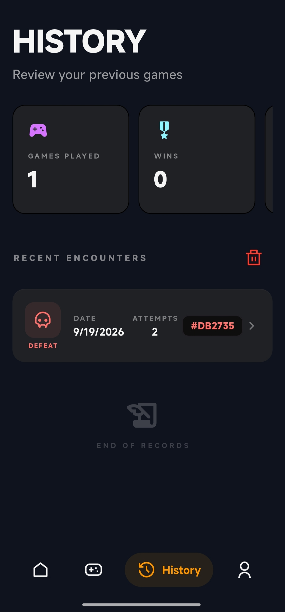
</p>

---

# 🎮 Game Modes

## 🌐 Online Multiplayer

Challenge another player through a real-time multiplayer match.

* Create a private game room.
* Join an existing room.
* Real-time game state synchronization.
* Two-player matches.
* Secret number selection.
* Turn-based gameplay.
* Turn timer.
* Guess validation.
* Automatic winner detection.
* Match results and history.

---

## 📴 Solo Challenge

Play a single-player challenge without requiring another player.

Players can configure their challenge and test their guessing skills while keeping their progress and results locally.

* No multiplayer opponent required.
* Configurable challenge setup.
* Attempt tracking.
* Local game history.
* Works without an internet connection.

---

# ✨ Features

### 🎯 Gameplay

* Smart number guessing system.
* Correct number and correct position feedback.
* Attempt tracking.
* Turn-based gameplay.
* Timed turns.
* Win/Lose results.

### 🌐 Online

* Real-time multiplayer.
* Room creation and joining.
* Live game state synchronization.
* Firebase-powered online infrastructure.

### 📴 Offline

* Solo Challenge mode.
* Local game persistence.
* Offline gameplay.
* Local history.

### 🔐 Authentication

* Email & Password authentication.
* Google Sign-In.
* Account-based player data.

### 📊 Profile & History

* Game history.
* Win/Lose statistics.
* Recent games.
* Player profile.

### 🎨 User Experience

* Modern dark UI.
* Smooth animations.
* Animated transitions.
* Loading states.
* Skeleton loading.
* Responsive layouts.
* Custom typography.
* Visual feedback throughout the game.

### 🔔 Notifications

* Local notifications for supported app events.

### 📤 Game Sharing

* Capture game summaries.
* Share game results using the device's sharing capabilities.

---

# 🧠 How the Game Works

The core idea of Guess Duel is simple:

Players try to discover a hidden number by making guesses.

The game provides feedback based on the guessed digits:

* **Correct Number** → The digit exists in the secret number.
* **Correct Place** → The digit exists and is in its correct position.

Players use this feedback to narrow down the possible combinations and improve their next guesses.

---

# 🎮 Online Game Flow

```text
Create / Join Room
        │
        ▼
      Lobby
        │
        ▼
Secret Number Selection
        │
        ▼
    Player Turns
        │
        ▼
      Guess
        │
        ▼
     Feedback
        │
        ▼
   Next Player
        │
        ▼
   Match Result
        │
        ▼
    Game History
```

---

# 🛠️ Tech Stack

## Core

* **Flutter**
* **Dart**

## State Management

* **BLoC / Cubit**
* **GetX**
* **Flutter Hooks**

## Backend & Authentication

* **Firebase Core**
* **Firebase Authentication**
* **Cloud Firestore**
* **Google Sign-In**

Firebase is used to handle authentication, online player data, game rooms, and real-time multiplayer synchronization.

## Local Storage

* **Hive**
* **SharedPreferences**
* **Path Provider**

Local storage is used for offline gameplay, caching, preferences, and locally persisted game data.

## Connectivity

* **Internet Connection Checker Plus**

Used to monitor network connectivity and support the online/offline experience.

## UI & Animations

* **Google Fonts**
* **Flutter Animate**
* **Skeletonizer**
* **Flutter SVG**
* **Remix Icon**
* **Salomon Bottom Bar**

## Utilities

* **Get It** — Dependency injection.
* **Equatable** — Value equality for state and model comparisons.
* **UUID** — Unique identifiers.
* **Intl** — Formatting and localization utilities.
* **URL Launcher** — External URL handling.
* **Screenshot** — Capturing game summaries.
* **Share Plus** — Sharing captured results.

---

# 🏗️ Architecture

Guess Duel is structured to keep the UI, state management, models, and services separated and maintainable.

The application uses **BLoC/Cubit** for feature-specific state management and separates business logic from presentation.

A simplified project structure:

```text
lib/
│
├── cubit/
│
├── models/
│
├── screens/
│
├── widgets/
│
├── services/
│
└── main.dart
```

The architecture focuses on:

* Separation of UI and business logic.
* Feature-specific state management.
* Reusable widgets.
* Dedicated models.
* Service-based data handling.
* Local and remote data management.
* Dependency injection.

---

# 🔥 Firebase

Firebase is a major part of the online experience.

### Firebase Authentication

Used for:

* Email & Password authentication.
* Google Sign-In.
* Managing authenticated users.

### Cloud Firestore

Used for:

* Game rooms.
* Players.
* Room state.
* Game progress.
* Match results.
* Real-time synchronization.

A simplified online architecture:

```text
             Flutter App
                  │
        ┌─────────┴─────────┐
        │                   │
 Authentication        Game Services
        │                   │
        ▼                   ▼
 Firebase Auth       Cloud Firestore
                            │
                            ▼
                    Real-time Updates
                            │
                    ┌───────┴───────┐
                    ▼               ▼
                Player 1         Player 2
```

---

# 💾 Offline Data

Offline functionality is supported through local persistence.

The application uses local storage to maintain information such as:

* Game history.
* Player data.
* Cached information.
* Local game state.
* User preferences.

This reduces unnecessary network dependency and allows the Solo Challenge experience to work without an internet connection.

---

# ⚡ Performance & UX

Several techniques are used to provide a smoother experience:

* Local caching.
* Efficient state management.
* Skeleton loading.
* Animated transitions.
* Reusable widgets.
* Local persistence.
* Connectivity awareness.
* Reduced dependency on network operations where possible.

The app also provides visual loading and transition states to make navigation and data loading feel smoother.

---

# 🚀 Getting Started

## Requirements

Before running Guess Duel, make sure you have:

* Flutter SDK
* Dart SDK
* Android Studio or another Flutter-compatible IDE
* Android SDK
* A configured Firebase project

---

## 1. Clone the Repository

```bash
git clone https://github.com/a7eliamany/Guess-Duel-Flutter-Game.git
```

Then navigate to the project:

```bash
cd Guess-Duel-Flutter-Game
```

---

## 2. Install Dependencies

```bash
flutter pub get
```

---

## 3. Configure Firebase

Configure Firebase for the platform you want to run.

For Android, add the required Firebase configuration file:

```text
android/app/google-services.json
```

> Make sure sensitive configuration files and credentials are not exposed publicly.

---

## 4. Run the Application

```bash
flutter run
```

---

# 📦 Build Release APK

To generate a release APK:

```bash
flutter build apk --release
```

The generated APK can be found under:

```text
build/app/outputs/flutter-apk/
```

---

# 📌 Version

## v2.0.0 — First Stable Release

Guess Duel `2.0.0` is the first stable release of the application.

This version introduces major improvements across the application, including:

* 🌐 Online multiplayer.
* 📴 Solo Challenge / offline gameplay.
* 🔐 Email & Password authentication.
* 🔵 Google Sign-In.
* 📊 Game history and statistics.
* 💾 Improved local data persistence.
* 🎨 Redesigned and polished UI.
* ✨ New animations and transitions.
* ⚡ Performance improvements.
* 🐛 Bug fixes and stability improvements.

---

# 🗺️ Roadmap

Planned improvements for future versions may include:

* [ ] Facebook Sign-In.
* [ ] Leaderboards.
* [ ] Achievements.
* [ ] Additional game modes.
* [ ] More player customization.
* [ ] Additional gameplay features.
* [ ] Further performance improvements.

> The roadmap is subject to change as development continues.

---

# 📚 What I Learned

Building Guess Duel provided hands-on experience with several areas of Flutter development, including:

* Building a complete Flutter application.
* BLoC/Cubit state management.
* Firebase Authentication.
* Cloud Firestore.
* Real-time multiplayer synchronization.
* Google Sign-In.
* Local persistence with Hive.
* Offline-first concepts.
* Network connectivity handling.
* Dependency injection.
* Caching strategies.
* Animations.
* Loading states.
* Reusable widgets.
* Game state management.
* Sharing generated content.
* Application release and version management.

---

# 👨‍💻 Developer

**Ahmed Eliamany Eltalawy**

Flutter Developer

<p>
  <a href="https://github.com/a7eliamany">
    
  </a>
  <a href="https://www.linkedin.com/in/ahmed-eliamany-036a5224a">
    
  </a>
</p>

---

# ⭐ Support

If you found Guess Duel interesting, consider giving the repository a ⭐ on GitHub.

Thanks for checking out Guess Duel! 🎮
