# 🎮 Guess Duel

Guess Duel is a Flutter-based number guessing game that combines logic, strategy, and competition.

The game allows players to challenge themselves through offline gameplay or compete online with other players. It provides a smooth gaming experience with animations, history tracking, and a modern interactive interface.

---

## 📱 Screenshots

### 🚀 App Flow

<p align="center">
  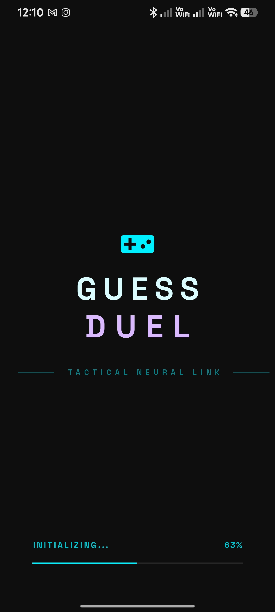
  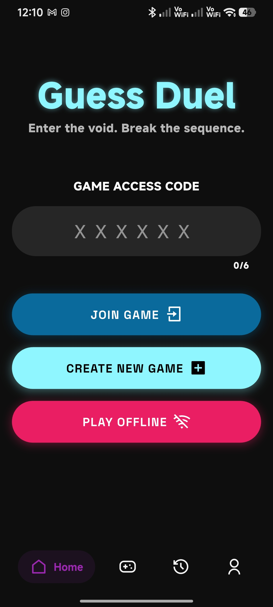
</p>

---

### 🌐 Online Mode

<p align="center">
  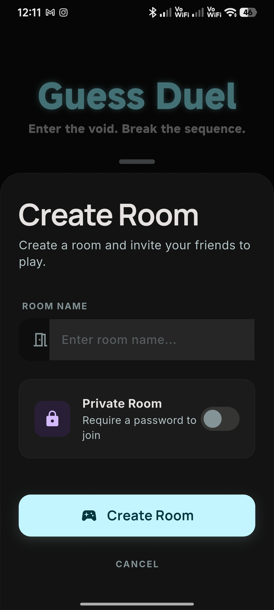
  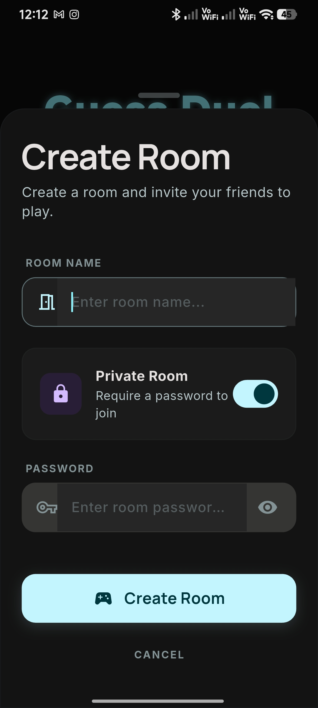
  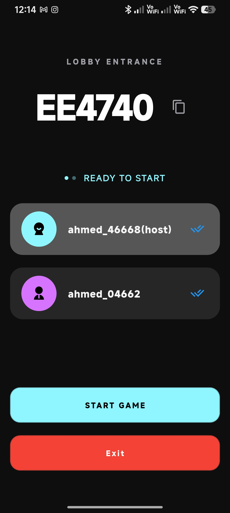
  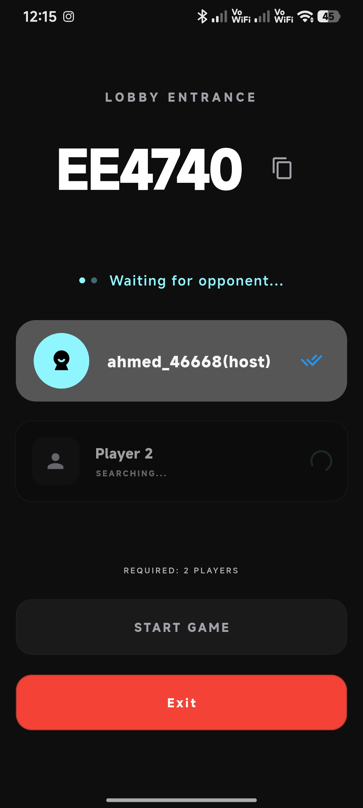
</p>

---

### 🎯 Gameplay

<p align="center">
  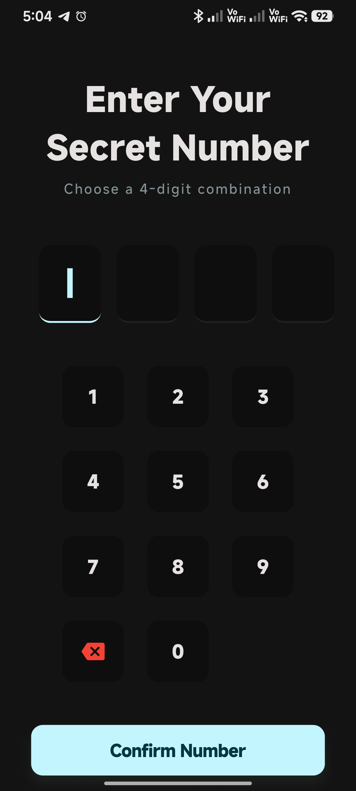
  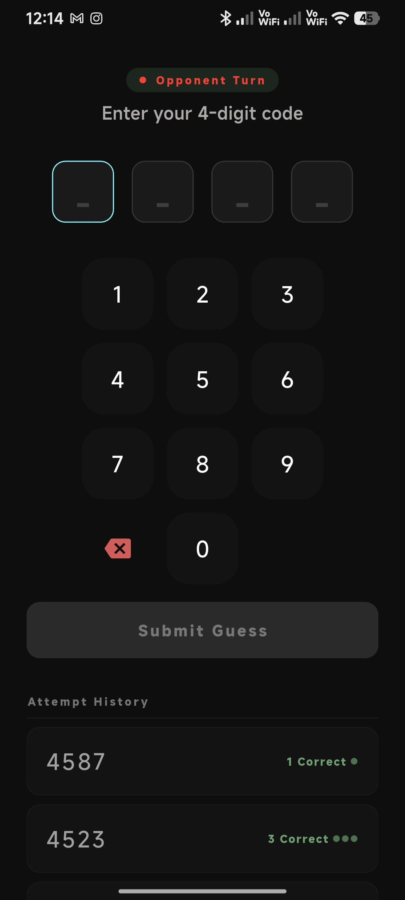
  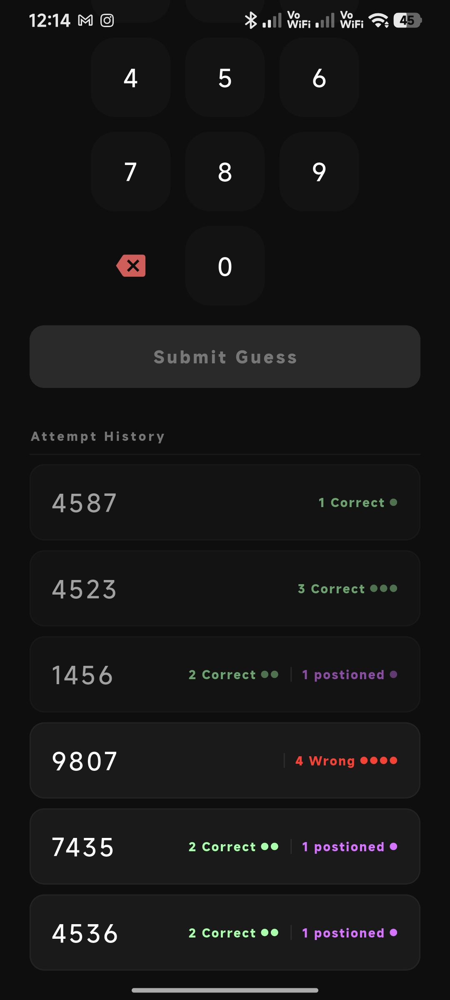
</p>

---

### 📴 Solo Challenge (Offline Mode)

<p align="center">
  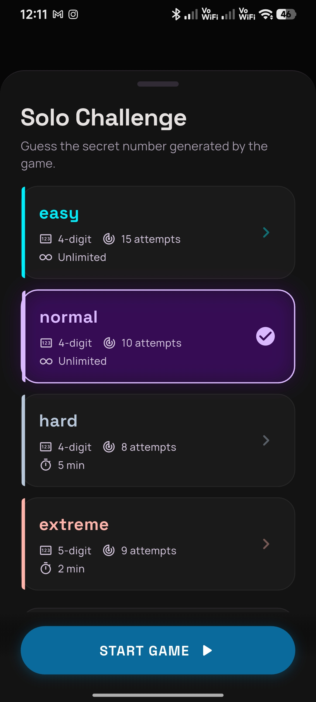
  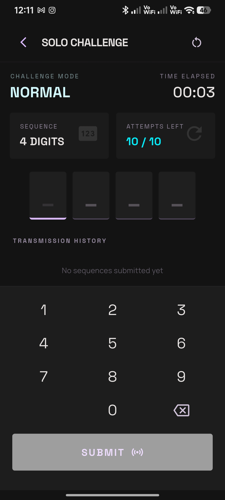
  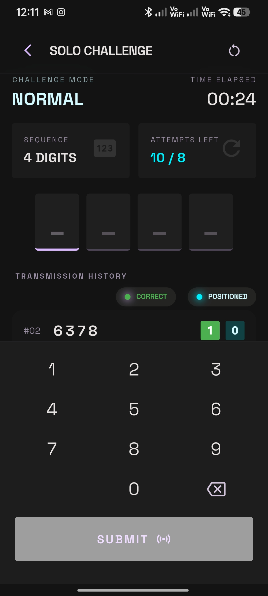
</p>

---

### 📜 History

<p align="center">
  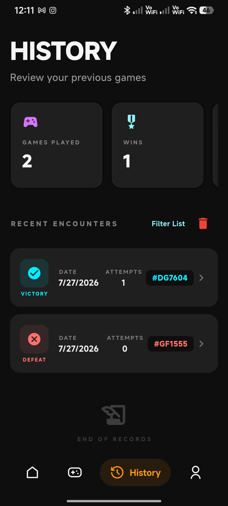
</p>
---

## 🎮 Game Modes

### 📴 Offline Mode
- Play against the system without requiring an internet connection.
- Track your attempts and improve your strategy.
- Save your gameplay history locally.

### 🌐 Online Mode
- Challenge other players in real-time gameplay.
- Synchronize game data online.
- Compete and test your guessing skills against others.

---

## ✨ Features

- 🎯 Online multiplayer gameplay
- 📴 Offline gameplay support
- 🔢 Smart number guessing system
- 📊 Attempts tracking
- 📜 Complete game history
- 🏆 Win/Lose results tracking
- 🎨 Modern animated UI
- ⚡ Smooth transitions and effects
- 🔔 Local notifications
- 💾 Local data persistence
- 📱 Responsive design

---

## 🛠 Technologies Used

- Flutter
- Dart
- BLoC / Cubit State Management
- Firebase
- Hive Database
- Flutter Local Notifications

---

## 🏗 Architecture

The application follows a clean and organized architecture:

- BLoC/Cubit for state management
- Separation of UI and business logic
- Reusable custom widgets
- Organized models and services
- Local and online data handling

Project structure:


lib/
│
├── cubit/
│
├── models/
│
├── screens/
│
├── widgets/
│
├── services/
│
└── main.dart


---

## 🚀 Getting Started

Clone the repository:

```bash
git clone https://github.com/a7eliamany/Guess-Duel-Flutter-Game.git

Install dependencies:

flutter pub get

Run the application:

flutter run
📦 Build Release APK
flutter build apk --release
🎬 Demo

(Add gameplay GIF here)

👨‍💻 Developer

Ahmed Eliamany Eltalawy

Flutter Developer

GitHub:
https://github.com/a7eliamany

LinkedIn:
https://www.linkedin.com/in/ahmed-eliamany-036a5224a
